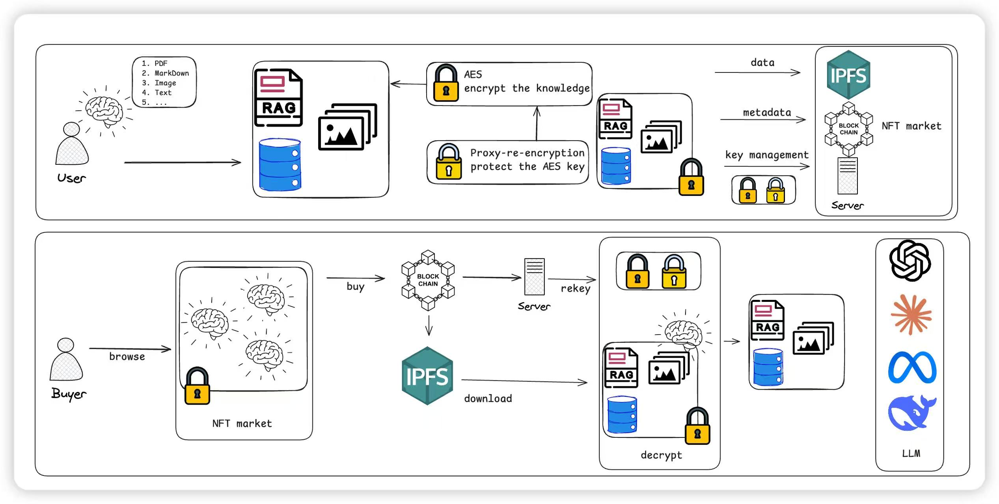

# 🧠 CyberBrain

> Turn your RAG (vector knowledge base) into a **secure, licensable, tradable** digital asset.  
> We combine **AES + Proxy Re‑Encryption (pyUmbral)** for encryption/authorization, **local/hosted IPFS** for storage, and **ERC‑721 (NFT)** for ownership/metadata. **NFT = Ownership; PRE = Usable Access.**

**English** | [**简体中文**](README.zh-CN.md)

## 🧠 One‑liner
**NFT holds the ownership; PRE governs the right to use.**  
**Mint your knowledge; keep decryption power in your own hands.**



---

## ✨ Highlights
- 🔒 **Always encrypted** – your RAG (e.g., `.faiss`) is AES‑encrypted; the AES key is protected via PRE.  
- 🗝️ **Fine‑grained authorization** – generate `kfrags` → proxy re‑encrypt → holder decrypts locally.  
- 🌐 **Local‑first storage** – work with a local offline IPFS node or a hosted pinning service.  
- 🪙 **ERC‑721 (NFT)** – NFT stores CID/metadata only; **no plaintext / no keys** on‑chain.  
- 🤖 **LLM‑ready** – once decrypted, the RAG can be used by any LLM/Agent (LangChain/LlamaIndex/custom).

---

## 📂 Repository Layout
```
.
├─ brain_store/
│  ├─ knowledge_index.faiss         # plaintext FAISS index (example)
│  └─ secondme.md                   # example source document
├─ dl/
│  └─ copied_encrypted_faiss.bin    # example/copy of encrypted blob
├─ ipfs_local_node/
│  └─ docker-compose.yaml           # local offline IPFS node (optional)
├─ keystore/                        # crypto/authorization artifacts (⚠️ gitignore recommended)
│  ├─ alice_pk.key / alice_sk.key / alice_sign.key
│  ├─ bob_pk.key   / bob_sk.key   / bob_sign.key
│  ├─ capsule.bin                  # Umbral capsule (key wrapper)
│  ├─ encrypted_aes.key            # AES key wrapped by Umbral
│  └─ encrypted_faiss.bin          # AES‑encrypted .faiss
├─ .gitignore
├─ downloaded_encrypted_faiss.bin   # file downloaded from IPFS (example)
├─ knowledge_processing.py          # build/split/embedding → FAISS (example)
├─ knowledge_protection.py          # AES + Umbral PRE encrypt/authorize/decrypt (PoC)
├─ knowledge_store.py               # upload via Pinata & download by CID
├─ local_knowledge_store.py         # local IPFS upload/download helper (optional)
└─ README.md
```

---

## 🧱 Requirements
- Python ≥ 3.9
- (Optional) Docker & Docker Compose for a local offline IPFS node
- Recommended: `python -m venv .venv && source .venv/bin/activate` (Windows: `.venv\Scripts\activate`)

**Python deps (example):**
```
pyUmbral==0.3.3
pycryptodome
ipfshttpclient
# faiss-cpu or faiss-gpu (optional, based on your stack)
```

> Pin pyUmbral to `0.3.3` to use `SecretKey / Signer / generate_kfrags` etc.

---

## 🚀 Quickstart (End‑to‑End)

### 1) Prepare a RAG index
Place your files under `/brain_store/`, e.g.:
```
./brain_store/secondme.md
```
Then run `knowledge_processing.py` to convert your content into a FAISS index (output: `brain_store/knowledge_index.faiss`).

### 2) Encrypt & generate authorization artifacts (PRE)
Run the PoC flow:
```bash
python knowledge_protection.py
```
It will produce:
- `keystore/encrypted_faiss.bin` (AES ciphertext)
- `keystore/encrypted_aes.key` and `keystore/capsule.bin`
- Alice/Bob key materials (`*_sk.key / *_pk.key / *_sign.key`)

### 3) Upload to IPFS & download by CID
```bash
python knowledge_store.py
```
This script uploads the encrypted blob to IPFS **via Pinata** and returns a **CID**, then downloads it back by CID for verification.

### 4) Grant decryption to the holder
- Alice generates `kfrags` for Bob → proxy re‑encryption yields `cfrags`  
- Bob uses `cfrags + capsule + encrypted_aes.key` to recover the AES key  
- Decrypt `encrypted_faiss.bin` locally → load the plaintext `.faiss` as your RAG source for LLM/Agents

---

## 🪙 ERC‑721 (NFT) — TODO
- **Ownership & metadata** only (e.g., `name/description/properties/cid/format/version`)  
- **No plaintext / no keys** in NFT metadata. Usable access is governed by **PRE**.  
- Provide a minimal `metadata.json` and an ERC‑721 mint script (local chain/testnet).

---

## 🛣️ Roadmap
- [ ] Minimal ERC‑721 contract & mint scripts (local/testnet)  
- [ ] Automated authorization (listen to NFT transfer → issue/revoke PRE keys)  
- [ ] Multi‑vault / multi‑tenant orchestration  
- [ ] Local web console (manage CID / authorization / download / decrypt)  
- [ ] Audit & logs (optional on‑chain provenance)

---

## 🤝 Contributing
Interested in building with us? PRs are welcome!  
When submitting a PR, please include motivation, design notes, and test points.

---

## 📄 License
We suggest **MIT** or **Apache‑2.0**. Add your choice to `LICENSE`.

---

## 🙏 Acknowledgements
- [pyUmbral (NuCypher)](https://github.com/nucypher/pyUmbral)  
- [IPFS](https://ipfs.tech/)  
- [FAISS](https://github.com/facebookresearch/faiss)

---
